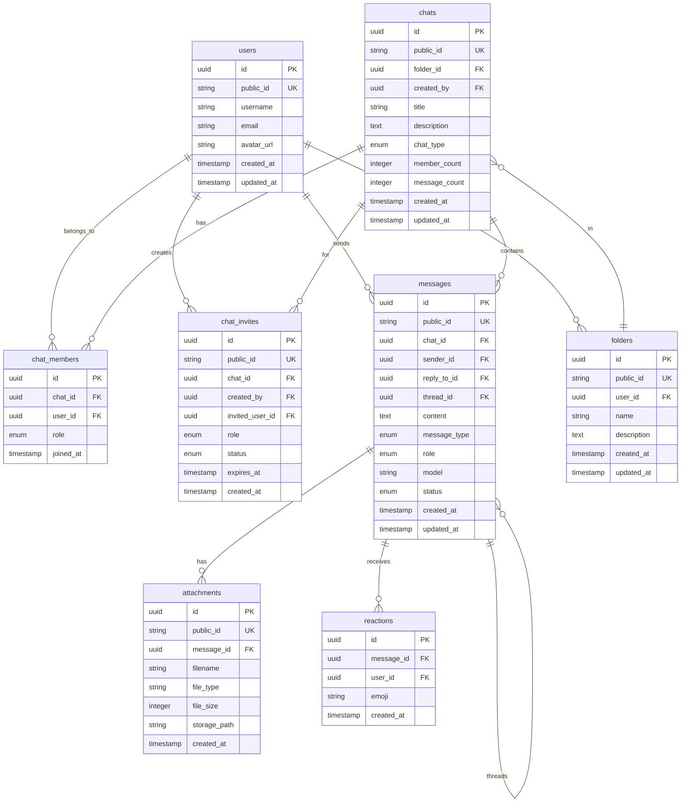

# Chat System Data Model



## Key Relationships

- **Users** create chats, folders, and send messages
- **Chats** belong to folders for organization
- **Chat members** define user permissions within chats
- **Messages** support threading via `reply_to_id` and `thread_id`
- **Attachments** are linked to messages for file sharing
- **Reactions** allow users to react to messages with emojis

## ID Strategy

The system uses a dual ID approach for optimal security and usability:

### cuid2 for Public IDs
Used for all user-facing and API-exposed identifiers:
- **Tables with cuid2**: `users`, `chats`, `messages`, `folders`, `attachments`, `invites`, `sessions`
- **Generated with**: `cuid2::cuid()`
- **Properties**:
  - URL-safe and web-friendly
  - Chronologically sortable (k-sortable)
  - Shorter than UUID strings
  - Higher entropy than UUID v4

### UUID for Internal System IDs
Used for internal system operations:
- **JWT token IDs** (`jti` claim)
- **Session tokens**
- **WebSocket event tracking**
- **Internal authentication tokens**
- **Generated with**: `uuid::Uuid::new_v4().to_string()`

### Storage Architecture: No KV Mapping Table

The system stores **both IDs directly** in each table rather than using a separate mapping table:

```sql
CREATE TABLE IF NOT EXISTS chats (
    id INTEGER PRIMARY KEY AUTOINCREMENT,    -- Internal integer ID
    public_id TEXT NOT NULL UNIQUE,          -- cuid2 for API
    user_id INTEGER NOT NULL,                -- FK to internal users.id
    ...
);
```

#### Rationale for Direct Storage:

1. **Performance**:
   - No extra JOIN required for ID translation
   - Internal foreign keys use integers (fastest joins)
   - Indexes on both `id` and `public_id` for optimal lookup

2. **Simplicity**:
   - One query instead of two for most operations
   - Less code complexity in repositories
   - No need to maintain mapping consistency

3. **Database Efficiency**:
   - SQLite optimizes integer primary keys with rowid
   - Storage overhead is minimal (TEXT field ~20 bytes)
   - Better cache locality with all data in one row

4. **Security through Obscurity**:
   - Internal IDs remain database-local
   - External systems only see cuid2 values
   - No sequential public IDs to enumerate

#### Lookup Patterns:

**Public API Operations**:
```sql
-- Find chat by public ID
SELECT * FROM chats WHERE public_id = 'cl2x9y...';
-- Then use internal id for joins
SELECT * FROM messages WHERE chat_id = <internal_id>;
```

**Internal Operations**:
```sql
-- Direct joins using internal IDs
SELECT m.*, c.public_id as chat_public_id
FROM messages m
JOIN chats c ON m.chat_id = c.id;
```

### ID Generation Workflow

1. **Creating a Chat** (`chat_repository.rs:245`):
   ```rust
   let public_id = cuid2::cuid();  // Public API identifier
   ```

2. **User Registration** (`user_repository.rs:128`):
   ```rust
   let public_id = cuid2::cuid();  // Username/public ID
   ```

3. **JWT Token Creation** (`jwt.rs:72`):
   ```rust
   jti: uuid::Uuid::new_v4().to_string(),  // Internal token ID
   ```

4. **Session Management** (`jwt.rs:128`):
   ```rust
   uuid::Uuid::new_v4().to_string()  // Internal session ID
   ```

#### Trade-offs Considered:

**Avoided KV Mapping Table Because**:
- Extra storage overhead (2x rows for mapping)
- Additional join complexity
- Cache fragmentation (more tables to cache)
- Migration complexity when adding new entities

**Challenges of Direct Storage**:
- Slightly larger table rows
- Need to maintain both indexes
- Potential for ID skew if not synchronized (mitigated by ACID transactions)

This architecture provides the best balance of performance, simplicity, and security for the chat system's needs.

## Constraints

- `public_id` fields use cuid2 for API exposure
- Internal system IDs use UUID for standardization
- Foreign key relationships ensure data integrity
- Enum fields provide type safety for statuses and types
- Timestamps track creation and modification times